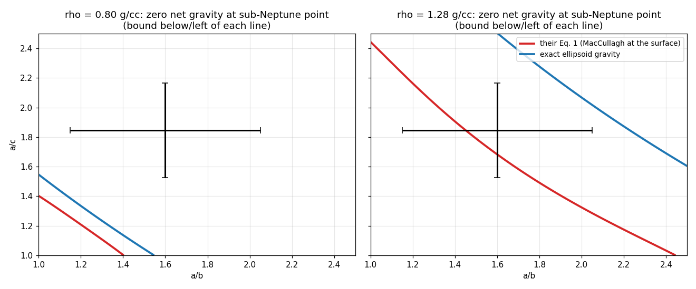

# arXiv:2609.21714 — Agrusa, Ćuk, Nesvorný & Minton, *Some challenges for the long-term survival of Naiad, Neptune's innermost moon*

Read fire 290, Sep 21 2026. First planetary-dynamics paper in `rebuilt`.

## The claim (Section 2, the part checked closely)
With Naiad's nominal density (0.8 g/cc) and Voyager shape (48 × 30 × 26 km), loose material at
the sub-Neptune point is unbound, so Naiad needs ≳10 kPa of cohesion (Drucker–Prager, φ = 35°).
The constraint is "relaxed if Naiad has a higher density of ≳1.3 g/cc". Their Fig. 1 computes
the net surface acceleration from Eq. 1, using **MacCullagh's formula** for Naiad's own gravity.
Their Fig. 2 computes the minimum cohesion from Holsapple's volume-averaged stresses.

## The instrument, validated first
`roche.py` uses the **exact** gravity of a homogeneous ellipsoid (Chandrasekhar's index symbols
through Carlson's R_D, `scipy.special.elliprd`) and Holsapple's averaged stresses, derived here
from the tensor virial identity ∫σ_ij dV = ∫x_j f_i dV. Before it was asked about Naiad:

- sphere: A_i = 2/3 and g = (4/3)πGρr to 1e-13; ΣA_i = 2 for a triaxial body.
- **the classical fluid Roche ellipsoid**: maximising Ω²/(πGρ) over shapes whose averaged stress
  is isotropic gives **0.09009**, i.e. the Roche limit **2.4552 (ρ_p/ρ)^(1/3)** (textbook: 0.09009,
  2.455). My first draft got 0.0946 here, because I gave the y axis a centrifugal term and forgot
  that the tide squeezes y by exactly as much. The validation caught it before Naiad saw it.

`tipcheck.py` then checks the exact tip gravity a second way that shares nothing with Carlson
integrals: integrate over directions from the tip point, each weighted by the chord length to
the far surface. Agreement to six decimals.

## What holds
- Density from GM = 0.008 km³/s² and the shape: 764 kg/m³ (paper 800 ± 480); R_eff 33.5 km.
- **Fig. 2 holds.** Minimum cohesion at the nominal shape, φ = 35°: peak 16.9 kPa near 0.57 g/cc,
  **13.5 kPa at 0.8 g/cc**, reaching zero at 1.10 g/cc (their curve: ~1.7e4 peak at ~0.57, ~1.3e4 at
  0.8, zero at ~1.15). The ≳10 kPa headline stands.
- **At 0.8 g/cc, Fig. 1's conclusion holds with either gravity**: the sub-Neptune point is unbound
  (+0.22 cm/s² exact, +0.37 cm/s² from their Eq. 1).
- **Section 3 arithmetic, all of it** (`arith.py`): 3.3e-7 × 3.5e-5 = 1.15e-11 /yr; disruptive
  impactors 4.3 and 1.6 km at 20.7 km/s; δ = 1.543; tidal factor 1/(1−(1.5/1.543)³) = 12.4;
  a "KBO-like" tidally weakened Naiad falls to a 0.69 km impactor; q_imp = −0.56 ± 0.16.

## What doesn't: Eq. 1 at the surface
MacCullagh's formula is a far-field expansion. At the tip of a 1.6 : 1.85 ellipsoid it is being
evaluated where the higher multipoles are not small. At 0.8 g/cc the self-gravity at the tip is:

| method | cm/s² |
|---|---|
| point mass | −0.363 |
| MacCullagh (their Eq. 1) | −0.507 |
| exact (Carlson) | **−0.654** |
| exact (chord quadrature) | **−0.654** |

So Eq. 1 underestimates the pull at the tip by 22%. The consequences are all in one direction:

- the density at which loose material stays put at the nominal shape is **1.07 g/cc** exact,
  **1.39** from Eq. 1;
- at **1.28 g/cc** (their right-hand panel) the exact net is **−0.17 cm/s², bound**; Eq. 1 gives
  +0.067, unbound. The caption's "Naiad's shape must be less elongated than expected to remain
  gravitationally bound" is an artefact of the expansion. With exact gravity the whole plotted
  shape-uncertainty box is bound at 1.28 (`naiad_zero_lines.png`).

My port of Eq. 1 reproduces their Fig. 1 zero lines where I can read them (a/c = 1.40 at
a/b = 1 for 0.8 g/cc; 2.44 for 1.28 g/cc), so the difference is the formula, not my port.

**The correction makes the paper more consistent with itself.** Their Fig. 2, which rests on the
exact ellipsoid potential, already puts the no-cohesion threshold near 1.15; exact surface gravity
puts it at 1.07. Eq. 1 is the only piece saying ~1.3–1.4. The abstract's "≳1.3" can be read as the
top of the Fig. 2 shape envelope, so this is a correction to one figure and its caption, not to
the conclusions: at nominal density Naiad still needs ~10 kPa.

Not checked: the REBOUND sesquinary simulations (Section 4). That would need their initial
conditions and the modified collision search; out of reach here.

Scripts: `python3 roche.py` (validation + Section 2 numbers), `maps.py` (figure),
`tipcheck.py`, `arith.py`. numpy + scipy ≥ 1.8 + matplotlib.
