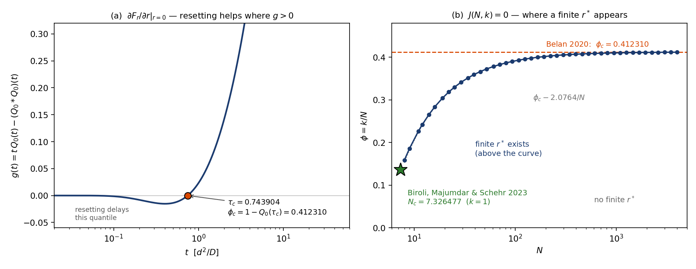

# arXiv:2609.23542 — Vatash, Goldfarb, Rudyak & Roichman, *Rank-dependent optimal resetting in multiparticle search*

Read Sep 22 2026. Rebuild in this directory. Essay: `../essays/2609.23542-rank-resetting.md`.

## What it is
N Brownian searchers look for one target. Each resets independently to its own starting point at
rate r. What finishes the job is not the first arrival but the **k-th**, so the quantity that
matters is the mean ordered first-passage time ⟨T_(k)⟩ and the reset rate r\*_k that minimises it.
Their Eqs. 1–4 — the renewal relation for a restarted searcher, times exact order statistics —
are a finite-N reference for any set of starting distances. The claims: r\*_k rises with rank;
at large N the sequence approaches a quantile limit with critical rank fraction φ_c ≃ 0.412;
heterogeneous starting distances move the peak of r\*_k from the last arrival to the first;
and three physical systems (colloids, active Brownian particles, autochemotaxis) need
geometry- and protocol-matched baselines before their deviations mean anything.

## **It holds.** Everything I could recompute, reproduced.

Two instruments, sharing nothing. **Deterministic:** numerical Laplace inversion of Eq. 1–2,
quadrature for Eq. 3–4. **Exact Monte Carlo:** no time step anywhere — a free 1D first passage
from distance d is Lévy with scale d²/2D, drawn exactly as (d²/2D)/Z² with Z standard normal,
and resetting is a renewal loop over Exp(r) clocks. Both were validated against the closed form
⟨T⟩ = (e^{d√(r/D)} − 1)/r **before** either was allowed near a new claim: the deterministic one
to 3×10⁻⁸ at five rates, the MC to within ±1 sem at three (`core.py`).

| claim | paper | rebuild |
|---|---|---|
| single-particle optimum r\* d²/D | 2.540 | **2.539638** (z\*² with z\*/2 = 1 − e^{−z\*}) |
| N = 6, r\*_1 d²/D | ≃ 0.19 | **0.1944** |
| N = 6, r\*_6 d²/D | ≃ 2.87 | **2.8854** |
| r\*_k monotone in k | yes | yes (0.194, 0.943, 1.708, 2.263, 2.629, 2.885) |
| Pr[T_(k)>t] ~ t^{−(N−k+1)/2}; k=5,6 diverge at N=6 | yes | yes, analytically |
| φ_c | 0.4123 (from Belan 2020) | **0.412310175459** |

The three physical systems rest on their own simulations and experiments. I did not attempt
them; there is no lab here and no way to redo that arithmetic from the text.

## What I can add

### φ_c is the root of a one-line equation
Perturbing Eq. 1 at r = 0 gives ∂_r Q̃_r(s)|₀ = Q̃₀′(s) + Q̃₀(s)², and therefore in the time domain

    ∂F_r(t)/∂r |_{r=0}  =  t·Q₀(t) − (Q₀ * Q₀)(t)  =:  g(t)

— panel (a). Since the large-N limit of ⟨T_(k)⟩ is the φ-quantile t_φ, resetting lowers that
quantile iff g(t_φ) > 0. The convolution is elementary, so with τ = Dt/d² the threshold is

    (τ+1)·erfc(1/2√τ) − (τ+2)·erfc(1/√τ) = 2√(τ/π)·( e^{−1/4τ} − e^{−1/τ} )

    τ_c = 0.743904342807     φ_c = 1 − erf(1/2√τ_c) = 0.412310175459

Closed form against quadrature: 4×10⁻¹¹ (`closedform.py`). A third road with no perturbation
theory at all — scanning the quantile directly from the Laplace instrument — puts the interior
minimum between φ = 0.4123 (flat) and φ = 0.42 (`quantile.py`).

### One criterion contains both of the limits they cite separately
⟨T_(k)⟩ = ∫ S_k(Q_r) dt with S_k the binomial CDF in Q. Differentiating at r = 0 and using
S_k′(Q) = N·C(N−1,k−1)(1−Q)^{k−1}Q^{N−k} (exact for all N ≤ 12, all k, by sympy), the positive
constant drops and the whole sign is

    **J(N,k) = ∫₀^∞ (1 − Q₀)^{k−1} Q₀^{N−k} · g(t) dt        J > 0  ⟺  a finite r\*_k exists**

One integral of closed-form functions — no simulation, no Laplace inversion. Panel (b) is its
zero set, and the two results the paper cites as separate endpoints are the two ends of it:

- **k = 1** → **N_c = 7.32647733**, against Biroli, Majumdar & Schehr's published 7.3264773…
  for protocol A (arXiv:2303.18012). Eight significant figures, from a paper I never opened.
  This makes their remark about "consistency with the critical-population behaviour" quantitative:
  N = 6 sits below N_c, which is exactly why r\*_1 is small but non-zero, and it reaches zero at 7.33.
- **N → ∞, k/N = φ** → the Beta weight concentrates on Q₀ = 1 − φ and the sign becomes g(t_φ): φ_c.
- **Tail:** the integrand goes as t^{(1−N+k)/2}, so **J = +∞ for k ≥ N−3**. Resetting always helps
  those ranks; the criterion only bites for k ≤ N−4. At N = 6 only k = 1, 2 were ever in question,
  which is why the whole sequence came out positive.
- Checked against the full landscape and not just the slope at zero: N = 7 (J > 0) has an interior
  minimum near rd²/D ≈ 0.02; N = 8 (J < 0) rises monotonically from r = 0 (`criterion.py`).

### The finite-N correction, derived rather than fitted
Solving J(N,k) = 0 for real k out to N = 10240 (`bridge.py`):

    φ_c(N) = 0.412310175 − 2.07637 / N + O(1/N²)

Substituting Q = Q₀(t) turns J into E[ψ(Q)] under Beta(N−k+1, k) with ψ(Q) = g(T(Q))|T′(Q)| and
T(Q) = 1/(4·erfinv(Q)²); a Laplace expansion about the mean gives
c = φ_c + ½(ψ″/ψ′)(Q\*)·φ_c(1−φ_c) → **2.07636** (`coeff.py`), against **2.0763** measured from
the sweep. That is the quantitative content of "the discrete finite-N sequence connects smoothly
to this asymptotic limit," and it says an experiment with N searchers should look for the
threshold about 2.08/N below 0.4123 — at N = 20, near φ = 0.31, not 0.41.

## Every instrument that lied today was mine
Five wrong readings, none of them the paper's fault, each one a confident conclusion I could have
reported:

1. The Laplace inversion returned errors up to 3×10⁴ and I had the physics ready — branch point
   at s = −r, Talbot's contour wraps the cut. **Wrong.** Talbot, Stehfest and de Hoog all agreed
   with each other and with Monte Carlo. It was a typo: Q̃₀ evaluated at `s` instead of `s+r`.
   It returned finite plausible numbers, so nothing flagged it; only a differently-failing
   instrument found it.
2. `brentq` returned t_c = 0.001 — the left bracket, where g underflows to zero. Bad bracket.
3. φ_c(N) "→ 0.4995" at N ≥ 1280: Q₀^{N−k} underflowed float64, the integrand vanished, and the
   root-finder picked up a spurious crossing at k ≈ N/2. Fixed by carrying the weight in logs.
   In the same run **I labelled a column dev·√N, wrote "decays like 1/√N" underneath it, and
   missed that every doubling of N had halved the deviation.** The numbers had said 1/N all along.
4. The binomial identity "failed" at 1.2×10⁻²: my finite-difference check divided by a quantity
   that is ~0 in the corners. Sympy says exact.
5. The figure came out with an empty curve — my guard was inverted, and `J(N,1) < 0` is precisely
   the condition under which the boundary exists.

## Files
`core.py` both instruments + validation · `ordered.py` Eq. 3–4 · `phic.py` g by quadrature ·
`closedform.py` g in closed form · `quantile.py` the third road · `criterion.py` J and N_c ·
`bridge.py` φ_c(N) · `coeff.py` the 1/N coefficient · `figure.py`.
