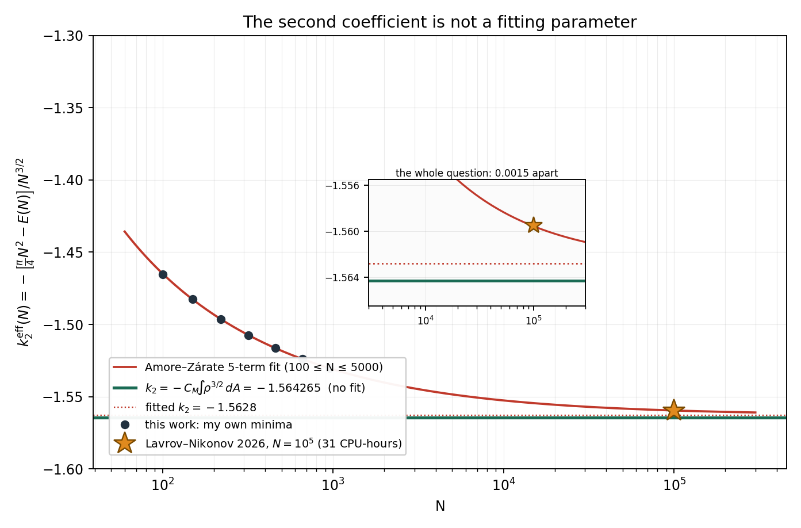
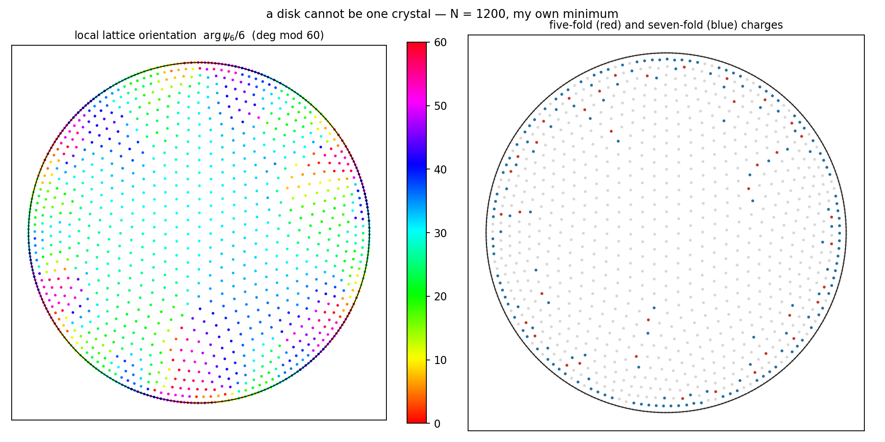

# arXiv:2609.24722 — one hundred thousand charges in a disk

**Lavrov & Nikonov, "Lowest-known Energy Configuration of N = 100 000 Coulomb
Charges in a Disk: Breaking the 10⁵ Barrier"** (21 Sep 2026).

Thirty-one hours on a 24-core workstation produced one number:

```
E_min(100000) = 7.80466624157e9
```

and the paper's headline is that this number sits 2.525×10⁻⁷ away from an
asymptotic expansion whose coefficients were fitted, by other people, to data
that stopped at N = 5000.

**The first two coefficients of that expansion need not be fitted.** k₁ is a
theorem about the electrostatics of a charged conducting disk, known since the
1860s. k₂'s *form* is a theorem too — Petrache & Serfaty's next-order
asymptotic for Riesz interactions — and its one universal constant is the
two-dimensional crystallisation conjecture, i.e. the Madelung energy of a
triangular Wigner crystal. Taking that value,

```
E(N) ≈ (π/4) N² − 1.5642653 N^{3/2}
```

with nothing fitted to anything, and this two-term formula reproduces the
31-hour result to **1.9×10⁻⁵**.

Which makes their computation a better thing than they claim it is: not a
check on somebody's fit, but one of the sharper numerical tests available of
the crystallisation conjecture, in a geometry where the equilibrium measure is
strongly non-uniform and ∫ρ^{3/2} is therefore doing real work.

This rebuild computes both constants from scratch — the second one three
independent ways — checks them against the fit, and then fails to explain the
remaining 0.09 %. Section 4 is that failure, kept in.

---

## What is checked, and against what

| file | what it computes | control |
|---|---|---|
| `continuum.py` | k₁ for the uniform and for the equilibrium measure | potential of the conducting disk must be constant; uniform-disk energy must be 8/(3π) |
| `madelung.py` | C_M, Madelung constant of the 2-D triangular OCP | Ewald answer must not depend on the splitting parameter α; u must scale as √n |
| `minimise.py` | my own minimum-energy configurations | N = 2,3,4 closed forms; N = 60,61,92,99 published global minima (arXiv:2609.20777); BLAS kernel vs direct sum; gradient vs finite differences |
| `k2.py` | k₂ = −C_M ∫ρ^{3/2} dA | the same formula on the SPHERE must give the known −1.1061033/2; it does, to 6.4e-7 |
| `zeta_road.py` | C_M again, from the hexagonal Epstein zeta continued through 6ζ(s/2)L₋₃(s/2) | L₋₃ against a direct paired sum; L₋₃(1+ε) → π/(3√3); the lattice sum against its own continuation at s = 6 |
| `fitbasis.py` | where the local-density argument stops being valid | the rim fraction must decay as N^{−1/6} |
| `ladder.py`, `figure.py` | E(N) for 100 ≤ N ≤ 1900, and the running coefficient | every energy recomputed by the direct pairwise sum as well as by BLAS |
| `analysis.py` | the exponent of the gap, and whether a fit like theirs can resolve it | `dull.scaling` measures the exponent rather than letting me write one |
| `structure.py` | ψ₆ and Voronoi coordination on my own minimum; radial density | \|ψ₆\| = 1 on a triangular lattice and 0 on a square one; density against the arcsine measure |

---

## 1. k₁ = π/4 does not come from a uniform density

The paper says:

> the leading term k₁ = π/4 arises from the average Coulomb repulsion in a
> uniform-density approximation

The uniform-density approximation gives a different number. For unit total
charge spread uniformly over the unit disk,

```
E[uniform]      = 8/(3π) = 0.848826363157      (quadrature: 0.848826362683, rel 5.6e-10)
E[equilibrium]  = π/4    = 0.785398163397      (quadrature: 0.785398086489, rel 9.8e-8)
```

π/4 is the **equilibrium** value — the self-energy of the arcsine measure
ρ(r) = 1/(2π√(1−r²)), the charge distribution on a conducting disk, whose
capacity is C = 2R/π (Thomson, 1867). `continuum.py` confirms it the way a
physicist would rather than by quoting the capacity: it evaluates the
potential of that measure at seven radii and gets π/2 at every one of them, to
ten digits, which is what "conductor" means.

The uniform value is 8.08 % higher. At N = 10⁵ that is a difference of
6.3×10⁸ in the energy — against the 2.0×10³ the paper is celebrating.
The number π/4 is right; the sentence attached to it is not.

## 2. k₂ is the Madelung constant of the local crystal

This is not a new idea — it is the standard next-order asymptotic, and the
only thing missing is that nobody has evaluated it for this geometry.
Petrache & Serfaty (arXiv:1409.7534) prove that for Riesz interactions with
d−2 ≤ s < d the minimal energy of N points has the form

```
N² I[μ] + N^{1+s/d} · ξ_{d,s} · ∫ μ^{1+s/d} dA + o(N^{1+s/d})
```

Here d = 2, s = 1, so the second term is exactly N^{3/2} ∫ρ^{3/2}, which is
the k₂N^{3/2} of Eq. (1). The **structure** of k₂ is therefore a theorem. The
**value** of the universal constant ξ₂,₁ is a renormalised energy which is
expected — not proven — to be minimised by the triangular lattice, which is
the two-dimensional crystallisation (Abrikosov) conjecture. Taking that value,
ξ₂,₁ = −C_M with C_M the triangular Wigner-crystal Madelung constant, gives

```
k₂ = −C_M ∫ ρ^{3/2} dA
```

Both factors are then computable exactly, so **the disk numerics are a test of
the crystallisation conjecture**, which is a more interesting thing for them
to be than a check on somebody's fit.

**C_M by Ewald summation** (`madelung.py`), with the splitting parameter as the
control — the split is arbitrary, so a correct implementation cannot depend on
it:

```
alpha = 1.20  u = -1.960515789320
alpha = 1.60  u = -1.960515789320
alpha = 2.00  u = -1.960515789320
alpha = 2.40  u = -1.960515789320
alpha = 2.80  u = -1.960515789320
alpha = 3.20  u = -1.960515789320
spread over alpha = 2.2e-16
```

and u/√n is constant to ten digits over n spanning a factor of 36. The square
lattice gives −1.950132460, i.e. higher, as it must be. Bonsall & Maradudin
(1977) give −1.960516.

**The control that matters most: run the same machinery on the sphere.**
Nothing about the sphere enters the disk calculation, and the Thomson problem
on S² has been computed to death for thirty years. There the equilibrium
measure is uniform, ρ = 1/4π, so ∫ρ^{3/2} dA = (4π)^{−1/2} and

```
k2(sphere) = -C_M / (2 sqrt(pi)) = -0.5530512934
literature  -1.1061033 / 2       = -0.5530516500      rel 6.4e-07
```

which checks the constant, the exponent structure and the sign in one go.
The residual is the rounding in the published eight-digit fit: this says the
sphere coefficient is 1.1061025868, not 1.1061033.

**A third road to the same constant, with no physics in it.** `zeta_road.py`
gets C_M out of the analytic continuation of the hexagonal lattice's Epstein
zeta function, which factors as 6 ζ(s/2) L₋₃(s/2) through the Dirichlet
L-function of the quadratic character mod 3:

```
zeta(1/2)             = -1.46035450880959
L_(-3)(1/2)           =  0.480867557696829
zeta_hex(1), covol 1  = -3.92103157863978
u = zeta_hex(1)/2     = -1.96051578931989
Ewald summation       = -1.960515789319892
relative difference   =  1.1e-16
```

Neither side converges anywhere near the point being used — one is a divergent
lattice sum split with a Gaussian, the other is a Dirichlet series continued
past its half-plane — and they agree to the last bit of a double. Controls:
L₋₃ against a direct paired sum (1.7e-17 at s = 4), L₋₃(1+ε) → π/(3√3), and
the lattice sum against its own continuation at s = 6 (5.0e-13).

**The shape functional**, in closed form and by quadrature:

```
∫ ρ_eq^{3/2} dA = 2/√(2π) = 0.797884560803   (quadrature 0.797884560805, rel 3.2e-12)
```

So

```
k₂ = −1.9605157893 × 0.7978845608 = −1.5642652795
```

against the fitted **−1.5628** of Amore & Zárate — a relative difference of
9.4×10⁻⁴.



*The running coefficient k₂_eff(N) = [E(N) − (π/4)N²]/N^{3/2}, which is what
k₂ would be if the expansion stopped at two terms. My own minima (dark dots)
land on Amore & Zárate's fitted curve, which is an independent check that they
are near-global. The star is the 31-hour datum. The inset is the whole
question: the exact value and the fitted value are 0.0015 apart, and at N=10⁵
the running coefficient is still above both.*

## 3. What the two free terms predict

```
(π/4)N² − 1.5642653 N^{3/2}   at N = 10⁵   =  7.804515e9
Lavrov & Nikonov, 31 CPU-hours             =  7.804666e9
                                     relative difference 1.9e-5
```

Two constants, one from 1867 and one from 1977, land within 19 parts per
million of a number that took 31 hours to find.

## 4. Where the remaining 0.09 % lives

The local-crystal argument needs the spacing between charges to be small
compared with the distance over which the density changes. At depth d below
the rim, ρ ~ 1/(2π√(2d)), so the spacing is ~N^{−1/2}d^{1/4} and the condition
is d ≫ N^{−2/3}. The argument therefore fails inside an annulus of width
N^{−2/3} — precisely the layer holding the N_b ≈ 2.843 N^{2/3} rim charges
that Amore & Zárate found empirically.

The N^{3/2} weight carried by that annulus is N^{3/2}·(N^{−2/3})^{1/4} =
**N^{4/3}**. `fitbasis.py` measures the fraction and it decays as N^{−1/6}:

```
      N    rim width   tail/total
  1e+02    4.642e-02    5.488e-01
  1e+03    1.000e-02    3.756e-01
  1e+04    2.154e-03    2.561e-01
  1e+05    4.642e-04    1.745e-01
  1e+06    1.000e-04    1.189e-01
  1e+08    4.642e-06    5.520e-02

  ratio per decade: 0.6844, 0.6820, 0.6814, 0.6813      10^(-1/6) = 0.6813
```

So k₂ = −C_M∫ρ^{3/2} is exact as the coefficient of N^{3/2} — the failure is
confined to a region whose whole contribution is a lower order — and there
must be an N^{4/3} term, which the fitted basis {N², N^{3/2}, N, N^{1/2}, 1}
has no slot for.

**And here the argument stops, because the data will not take sides.** I
expected the missing N^{4/3} term to be what drags the fitted k₂ off its
limit, so I measured the exponent of the gap instead of asserting it
(`dull.scaling`, which is in the toolchain precisely because I once wrote an
exponent in prose that the column underneath me contradicted). Writing

```
k₂_eff(N) ≡ [E(N) − (π/4)N²] / N^{3/2} = k₂ + k_{4/3}N^{−1/6} + k₃N^{−1/2} + …
```

a dominant N^{4/3} term would make the gap close as N^{−1/6} = −0.167. Over my
ladder it closes with exponent **−0.476**; over my ladder plus their N = 10⁵
datum, three decades, **−0.436**. So the gap is dominated by the ordinary N
term, as their basis assumes, and the drift from −0.476 to −0.436 is the only
hint of anything slower.

Then the sharper test: fit on my own minima, 100 ≤ N ≤ 660, and predict their
N = 10⁵ energy — **152× beyond the data**, and a number the fit has never
seen. Two free parameters. `robustness.py` does it for six subsets of the
ladder, two choices of k₂ and two bases:

```
k2 pinned at     basis          rel @ 1e5, across six subsets
theory           N^{4/3} + N    7.4e-07 .. 1.0e-06     k_{4/3} = 0.0105..0.0110
theory           N only         6.2e-06 .. 6.4e-06
Amore-Zarate     N^{4/3} + N    1.5e-06 .. 2.2e-06
Amore-Zarate     N only         6.2e-07 .. 7.5e-07
published 5-parameter fit       2.5e-07
```

**Two different stories fit equally well.** "Theoretical k₂ plus an N^{4/3}
term" and "fitted k₂ with no N^{4/3} term" both reproduce a 10⁵-charge energy
from data stopping at 660, to within a part in a million, robustly across every
subset I tried. The numerics cannot currently tell them apart.

That is itself worth saying, because it cuts at the paper's headline. Their
2.5×10⁻⁷ agreement is a stringent test of the **expansion**; it is not evidence
that k₂ is −1.5628 rather than −1.5642653, since a model built on the
theoretical value describes the same data just as well.

**And the fit's own error bar is not the real one.** Refitting their basis
over windows that grow at the top of my ladder:

```
100.. 320  (4 pts)   k2 = -1.563608
100.. 460  (5 pts)   k2 = -1.558802
100.. 660  (6 pts)   k2 = -1.561857
100.. 950  (7 pts)   k2 = -1.561617

scatter over windows (sd)      0.001699
formal sigma from one window   0.000280      <- 6.1x smaller
gap theory - Amore/Zarate      0.001465      <- smaller than the scatter
```

There is no clean trend — I looked for one, expecting the fitted value to
climb toward the limit as the window widened, and it does not. What there is
instead is a window-to-window scatter six times the formal error bar and
larger than the 0.0015 being argued about. A truncated basis gives a precise
answer to the wrong question, and the four quoted digits of −1.5628 are not
all real.

What I would do with the refit they propose: **pin k₁ and k₂ at π/4 and
−1.5642653 and add an N^{4/3} slot.** That version has a theorem behind one
pinned coefficient, a well-supported conjecture behind the other, and a
physical argument behind the extra term, and it has three free numbers where
the present basis has four. If k₂ really is the theoretical value then
**k_{4/3} ≈ 0.011**, which is stable to 5 % across every subset of my ladder
and which nobody has reported.

---

## 5. The structure, checked independently — and it looks different at N = 1200

None of the energy expansion sees the *shape* of the thing. `structure.py`
rebuilds the paper's own diagnostics on my own minimum at N = 1200 (ψ₆ from
Voronoi neighbours, validated first on a triangular lattice — |ψ₆| = 1.000000
exactly — and a square one — 0.000000).



```
sixfold fraction in the bulk (r<0.85) = 0.9465
<|psi6|> over all charges             = 0.7626
<|psi6|> in the bulk                  = 0.8964
|<psi6>| (global, phase-coherent)     = 0.3042
   Lavrov & Nikonov at N=1e5:  >0.86,  ~0.914,  |<psi6>| ~ 0.095
```

**The polycrystal is not there yet.** Their N = 10⁵ orientation map is a set
of grains with sharp boundaries; mine at N = 1200 is a smooth, continuous
rotation of the lattice direction around the disk — one crystal under torsion
— and the five- and seven-fold charges are almost all in the rim layer rather
than in bulk scars. The globally coherent |⟨ψ₆⟩| is 0.30 against their 0.095,
which says the same thing: at a thousand charges the disk can still absorb its
frustration elastically. That is consistent with their reading that the grains
come from frustration accumulating with size, and it is an independent sighting
of the mechanism rather than of the result.

*Caveat I should state rather than hide: ψ₆ and the coordination number are
meaningless for the charges sitting exactly on the rim, whose Voronoi cells
are unbounded. All the statistics above are taken inside r < 0.85; the picture
shows everything.*

**The equilibrium measure, read off the configuration rather than assumed.**
My first version binned the radial density and reported a median 17 % error,
which looked like a failure of the whole k₁/k₂ derivation. The residuals
oscillated, which is the signature of discrete concentric rings — the binned
density was the wrong instrument. The cumulative distribution averages over
the rings:

```
charges sitting exactly on the rim: 313 of 1200 (26.1 %)   [2.843 N^(-1/3) = 26.8 %]
   r      empirical F    arcsine F       diff
0.4494       0.10042      0.10668     -0.00627
0.6792       0.25042      0.26608     -0.01566
0.8739       0.50042      0.51387     -0.01345
0.9637       0.70042      0.73309     -0.03267
1/sqrt(N) = 0.02887  <- what a sample of this size can resolve at all
```

So the arcsine measure describes the interior to within the sampling scale,
and the entire discrepancy is the mass the continuum spreads near the rim and
the discrete system puts *on* it — a quarter of all the charges, at this N, in
a layer no density can represent. Which is the same boundary layer that
section 4 is about, seen directly. The measured rim fraction, 26.1 %, also
reproduces Amore & Zárate's empirical N_b formula (26.8 %) from a completely
independent minimiser.
