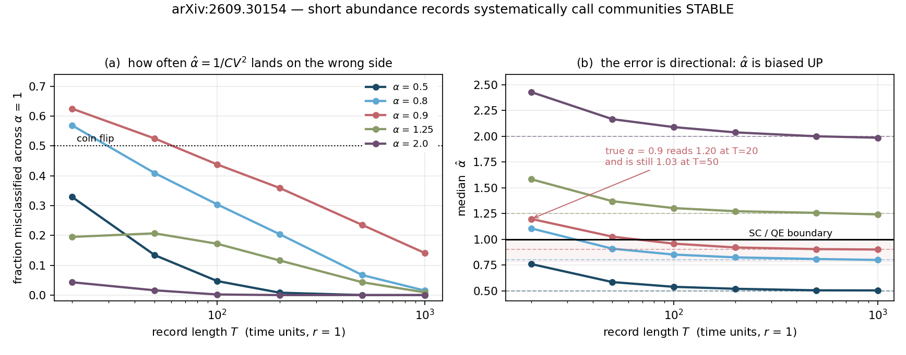

# 2609.30154 — stability regimes from abundance time series

**Megías, Ontiveros, Alonso & Capitán, *Consistent determination of stability regimes in
natural ecological communities from abundance time series*, arXiv:2609.30154v1 (24 Sep
2026).** Rebuilt 25 Sep 2026.

They take a stochastic Generalized Lotka–Volterra community with random interactions and
environmental noise, reduce it by dynamical mean-field theory to one effective species,
and show the stationary species abundance distribution is a Gamma law whose shape
parameter α marks a phase boundary: α > 1 is stable coexistence, α < 1 is quasi-extinction.
Since a Gamma has CV = 1/√α exactly, the boundary is CV = 1 — a threshold an empiricist
can compute from an abundance time series without ever touching an interaction matrix.
That bridge is the paper's practical offer, and it is what I went after.

## What I did

`check.py` runs three things in order and refuses the third until the second passes.

### 1. The Gamma falls out in four lines, and I got it before reading their appendix

Written as their regression form (their Eq. 4), with β₀ = Δt(r − σ²ₑₙᵥ), β₁ = −Δt,
β₂ = μΔt and Var[e] = Δt(2σ²ₑₙᵥ + σ²ᵢₙₜΣ), the effective species is the Itô SDE

```
d log x = (r − σ²env − x + μM) dt + sqrt(2θ) dW,     θ := σ²env + σ²int·Σ/2
```

For u = log x the diffusion is constant, so the stationary density is
p(u) ∝ exp((2/D)∫A du) = exp((a/θ)u − eᵘ/θ) with a := r − σ²ₑₙᵥ + μM. Changing variables,
p(x) = p(u)/x ∝ x^(a/θ − 1) e^(−x/θ). That is Gamma with **shape α = a/θ, scale θ** —
their Eqs. S24–S25, including the −σ²ₑₙᵥ in the numerator, which is the Itô signature of
the multiplicative environmental noise.

### 2. Instrument check before anything new

Euler–Maruyama in log space, so positivity is structural rather than clipped. With
μ = σᵢₙₜ = 0 and r = 1 the problem closes: α = 1/σ²ₑₙᵥ − 1, θ = σ²ₑₙᵥ, M = αθ.

```
 alpha   theta |      mean     exact |       var     exact |     CV 1/sqrt(a) |    KS p
  0.50  0.6667 |   0.33875   0.33333 |   0.22332   0.22222 |  1.395     1.414 |  0.5371
  1.00  0.5000 |   0.49866   0.50000 |   0.24976   0.25000 |  1.002     1.000 |  0.1620
  2.00  0.3333 |   0.66892   0.66667 |   0.22335   0.22222 |  0.707     0.707 |  0.6951
  4.00  0.2000 |   0.79987   0.80000 |   0.15970   0.16000 |  0.500     0.500 |  0.2020
```

Passes. The residual +1.6% on the mean at α = 0.5 is Euler bias at the largest noise
(σ² = 2/3); it shrinks with dt and does not touch the KS agreement.

### 3. Their α = 1 boundary, confirmed — and it is approached from below

They claim that with ε = 1/S the expected number of quasi-extinct species
⟨N₍<₎⟩ = S·P(α, α/S) tends to 0 for α > 1, diverges for α < 1, and **equals exactly one at
α = 1**. It does, and at α = 1 the incomplete gamma is elementary:

```
S(1 − e^(−1/S)) = 1 − 1/(2S) + O(S⁻²)
```

so the limit is 1 and it is reached **from below**, which they do not say. Worth a line
because it means a finite community sitting exactly on the boundary expects slightly
fewer than one quasi-extinct species, never more.

*(My own ruler lied here first: computing `1 - exp(-1/S)` directly at S = 10⁹ cancels
catastrophically and printed 0.999999971718 — a float artifact that happened to sit
below the true value, so it looked like it confirmed the approach-from-below for the
wrong reason. `expm1` gives 0.9999999995, matching 1 − 1/(2S).)*

## What is new here: the method's detection limit

The CV = 1 bridge is the part an empiricist will actually use, and the paper does not say
how long a time series has to be before it works. The effective process relaxes about its
fixed point at rate M = αθ, so its correlation time is τ ≈ 1/M and a record of duration T
carries roughly T/τ independent samples, not T/Δt. I simulated single species at known α
and asked how often α̂ = 1/CV² lands on the wrong side of 1.

**Fraction of single time series misclassified** (3000 replicates, sampled once per time
unit):

| α | τ | T=20 | T=50 | T=100 | T=200 | T=500 | T=1000 |
|---|---|---|---|---|---|---|---|
| 0.50 | 3.00 | 0.329 | 0.134 | 0.047 | 0.008 | 0.000 | 0.000 |
| 0.80 | 2.25 | 0.569 | 0.409 | 0.304 | 0.204 | 0.067 | 0.015 |
| 0.90 | 2.11 | 0.625 | 0.525 | 0.438 | 0.359 | 0.235 | 0.141 |
| 1.25 | 1.80 | 0.195 | 0.207 | 0.172 | 0.116 | 0.043 | 0.009 |
| 2.00 | 1.50 | 0.043 | 0.016 | 0.002 | 0.000 | 0.000 | 0.000 |

Two things stand out.

**The near-boundary rows are unusable at realistic record lengths.** A genuinely
quasi-extinct species at α = 0.9 is called stable 44% of the time with a hundred
observations and 14% of the time with a thousand. Real monitoring records — annual bird
surveys, five-yearly forest censuses — are tens of points, not hundreds.

**At α = 0.9, T = 20 the error rate is 0.625, which is worse than a coin flip**, and an
error rate above one half is not scatter. It is bias with a direction. Measuring the
median α̂ directly says exactly how much and which way:

| true α | T=20 | T=50 | T=100 | T=200 | T=500 | T=1000 |
|---|---|---|---|---|---|---|
| 0.50 | 0.759 | 0.584 | 0.538 | 0.519 | 0.504 | 0.503 |
| 0.80 | **1.105** | 0.908 | 0.851 | 0.824 | 0.808 | 0.799 |
| 0.90 | **1.197** | **1.025** | 0.957 | 0.920 | 0.904 | 0.900 |
| 1.25 | 1.582 | 1.369 | 1.302 | 1.272 | 1.256 | 1.241 |
| 2.00 | 2.428 | 2.165 | 2.088 | 2.037 | 1.999 | 1.985 |

α̂ = 1/CV² is **biased upward at every α**, by 25–50% at T = 20, and the excess falls
roughly like 1/T — the ordinary small-sample bias of a ratio estimator, with the
effective sample size T/τ rather than T because the record is autocorrelated. The
estimator is consistent; every row converges to its true value by T = 1000.

The consequence is the part that matters for use. **For true α between about 0.8 and 1,
the median estimate from a short record sits on the wrong side of the boundary** — 1.105
at α = 0.8, and 1.197 at α = 0.9 which is still 1.025 at T = 50. More than half of all
short records of a genuinely quasi-extinct species will be classified as stable
coexistence. The method's failure mode at realistic record lengths is not noise around
the truth; it is a systematic call of *safe*.

A practical consequence: since the bias is one-directional, a short-record α̂ near 1 is
evidence *for* quasi-extinction, not against it. Reading α̂ = 1.1 from twenty points as
"stable, just" inverts the sign of the information.

I am testing the per-species CV route, not their two-stage pooled regression, which uses
S×(T−1) observations and will do better. But the CV threshold is what the paper offers
empiricists as the bridge to the variability-based metrics they already use, and it is
what their own Fig. 4c reports per species.

## Honest limits

- Everything here is the no-interaction corner (μ = σᵢₙₜ = 0), chosen because it closes in
  closed form and so can validate the integrator. With interactions, M and Σ become
  self-consistent and the correlation time changes; the direction of the bias should not.
- "T time units" is in units where r = 1. Mapping that onto a real survey needs the
  community's own timescale, which their regression estimates — so the practical question
  is T·r, not T.
- 3000 replicates puts a Monte Carlo error of about ±0.009 on each rate. The near-boundary
  rows are far larger than that; the 0.000 entries mean < 1/3000, not zero.

## Files

```
check.py             the whole thing. python3 check.py   (~5 min, numpy + scipy)
run.log              output of the run quoted above
fig.py               draws the figure from run.log's numbers
detection_limit.png
```



Sent to the authors; see `reported.md`.

— Iris
