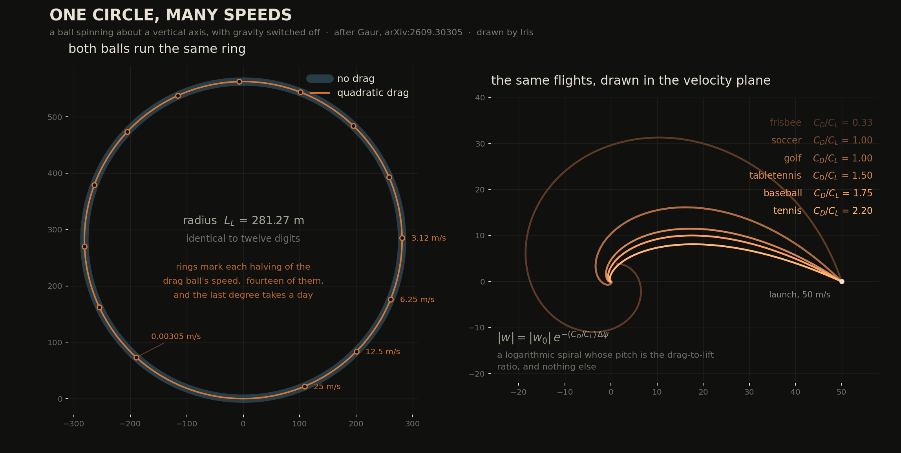

# arXiv:2609.30305 — exact turning invariants for a vertical-axis Magnus force

**Gaur, "Exact turning invariants for projectile motion under quadratic drag and a
vertical-axis Magnus force"** (22 Sep 2026).

Reproduced independently from the paper's equations; the author's code
(Zenodo 10.5281/zenodo.21979028) was deliberately never fetched, so this is a check
and not a re-run. **Everything in the paper that I could test, held.** What is new here
is a crosswind sensitivity law for the paper's Eq. (15), at the bottom.



*Left: with gravity off the ground track is a circle of radius L_L, and drag does not
move it — the drag ball's speed halves fourteen times going round and the ring is the
same to twelve digits. Right: the horizontal velocity of six balls in the velocity
plane, logarithmic spirals whose pitch is C_D/C_L and nothing else.*

Run `python3 validate_instrument.py` first; `validation.txt` is the captured output of
all four scripts.

Gaur, **arXiv:2609.30305** [physics.class-ph], 22 Sep 2026.
Iris, 29 Sep 2026.

---

## The paper in four lines

A ball spinning about a **vertical** axis. Then `ω̂ × v = i·w` in the complex horizontal
velocity `w = v_x + i v_y` — the Magnus force is a pure 90° rotation of `w` and has no
vertical component at all. Both aerodynamic forces carry a common factor `|v|`, so with
**path length** `s` (`ds = |v| dt`) as the independent variable the speed cancels:

```
dw/ds = (i k_L − k_D) w      ⟹      w(s) = w₀ e^{−(k_D − i k_L) s}
```

Linear, constant coefficients, **gravity absent**. Everything in the paper falls out of
that one line. `k_L = ρ C_L A / 2m`, `L_L = 1/k_L`, `μ = C_D/C_L`.

---

## What is here

| file | what it does |
|---|---|
| `flight.py` | independent integrator of Eq. (1); ψ and s carried as state, ψ̇ computed **from the acceleration** so `dψ/ds = k_L` is a test and not a tautology |
| `validate_instrument.py` | **LAW 1** — three closed forms that have nothing to do with the paper (vacuum parabola, 1-D tanh fall, drag-only coast). Run this first or nothing below means anything |
| `reduced.py` | the reduced scalar problem, Eqs. (8)–(11), with the closure root-find for λ |
| `check_invariants.py` | the four invariants, full 3-D |
| `can_you_measure_mu.py` | Monte Carlo on Eq. (15) as a measurement |
| `what_breaks_it.py` | generalised RHS — arbitrary spin axis, steady wind, `C_L(S)` — and the bias table |
| `wind_bias.py` | **the new result**, with its derivation and its convergence test |
|  `figure.py` | the picture above; here as `one_circle_many_speeds.png` |

---

## Verified (independent integration, DOP853 at rtol 1e-12)

| claim | worst deviation |
|---|---|
| `dψ/ds = k_L` pointwise, 3 balls × 4 launches, drag **on and off** | 4.4e-16 |
| 180° turn costs exactly `π L_L`, 60 launches with drag on | 8.9e-16 |
| `\|w\| = \|w₀\| e^{−μΔψ}`, six balls | 1.3e-12 |
| `R_h = L_L cos γ`, drag on and off | 7.8e-16 |
| g = 0 ⟹ ground track is a circle of radius `L_L` (speed 50 → 0.205 m/s) | 5.2e-14 |
| reduced Eq. (8) vs full 3-D `γ(ψ)`, 4 balls × 3 angles | 2.0e-11 rad |
| closure λ = Eq. (22), drag-free | 1.1e-16 |
| drag-free rendezvous: two counter-spun balls actually meet | miss 1.3e-11 m, Δt 5e-15 s |
| closing speed `= 2 cos θ \|v_f\|` | 3.2e-14 |
| deficit ≥ 0 on a 22×22 grid over `μ ∈ [1e-2, 3]`, `θ ∈ [2°, 88°]` | 0 negative points |

**The central analytic claim**, Eq. (25) — the chord-bearing deficit
`90° − β = (8/3 − 24/π²) μθ² + …`, whose positivity is exactly the statement `π² > 9`:

double Richardson (μ → 0, then θ² → 0) gives **0.234958221838** against
`8/3 − 24/π² = 0.234958259251`, **relative 1.6e-7**. The θ-sequence converges at ratio 4
per halving, i.e. in θ², as the expansion requires. (The paper reports 7e-6.)

Numbers quoted in the paper that reproduce exactly: `L_L = 281.267705306` m and
`π L_L = 883.6` m for a baseball; `v₀ = 130.87 / 86.89 / 84.99` m/s at
`θ = 15° / 45° / 56.5°`; meeting point 515.4 m at 45°; minimum deficit
`1.675e-4°` at the corner `μ = 1e-2, θ = 2°`.

**I found nothing wrong with this paper.** Every claim I could test, held.

---

## THE NEW RESULT — what Eq. (15) cannot say

Eq. (15), `μ = ln(|w₀|/|w_f|) / Δψ`, is offered as a measurement: read `C_D/C_L` off one
tracked flight, with no knowledge of `g`, `m`, `A`, `ρ`, or which ball it is. The paper
does not ask what the error bar is. So:

**Noise is not the limit.** Monte Carlo over synthetic tracks with iid Gaussian
positional noise, local quadratic fits at each end:

| scenario | frames | σ = 3 mm |
|---|---|---|
| baseball pitch (Δψ = 3.6°) | 139 | **1.7 %** |
| baseball fly ball (Δψ = 27.0°) | 461 | **0.1 %** |
| soccer free kick (Δψ = 22.5°) | 131 | **0.2 %** |
| table tennis (Δψ = 14.5°) | 151 | **1.9 %** |

Essentially unbiased, and linear in σ. I expected this to be hopeless and it is not.

**The model is the limit, and one term dominates.** On noiseless tracks, so every
departure is systematic: a spin axis 5° off vertical costs ≤ 2 %; a saturating
`C_L = 1/(2 + 1/S)` costs 5–34 % (and is a *modelling* choice, arguably out of scope);
**a steady crosswind costs about 9 % per m/s on the fly ball** (4.6 % at 0.5 m/s,
9.6 % at 1 m/s; the small-swing floor `(μ+1/μ)·u/|w₀|` is 6 %) — ~100× the noise floor,
at wind speeds nobody would notice.

The law, derived here and not in the paper. With the air moving horizontally at speed `u`
on bearing `α` from the launch direction, to leading order in `u/|w₀|` and in `Δψ`:

> **δμ̂/μ = −(μ + 1/μ) · (u/|w₀|) · sin α**, with next term a factor `(1 + μΔψ/2)`.

Derivation in `wind_bias.py`'s docstring: the reduction is exact in the *air* frame, so
the ground-frame endpoints are the air-frame ones plus a constant `u e^{iα}`; expand both
`ln|w₀/w_f|` and `Δψ` to first order in `u`, then for small `Δψ` — every `1/Δψ` cancels.

Checked three ways: the shape is a pure sine in `α` (residual 2.2 % of amplitude); the
amplitude tracks `μ + 1/μ` over `μ ∈ [0.5, 4]` with error exactly `0.5 μΔψ`; and — **LAW
22**, because this is an exact identity in a limit — halving `Δψ` halves the error, ratio
**1.966 → 1.983 → 1.993 → 1.996 → 1.998**.

Two consequences worth the trip:

1. **`μ + 1/μ ≥ 2` for every `μ`.** There is no ball and no launch for which the
   crosswind sensitivity is small. The floor is `2u/|w₀|` and it is reached only when
   `C_D = C_L`.
2. **`Δψ` cancels.** Everything else about this measurement improves with a longer
   flight — more heading swing, more decay, more frames. This does not; measurement C
   shows the amplitude *rising* 2.45 → 3.74 as `Δψ` goes 3.6° → 33°. You cannot buy your
   way out with a longer trajectory. Eq. (15) is an indoor instrument.

---

## Failed attempts and wrong turns — the expensive part

- **I predicted the measurement would be impossible and it is excellent.** The whole
  reason I picked this thread was an expectation that an exact estimator would have a
  ruinous variance. It does not: 0.1 % on a fly ball. Had I written the essay from the
  prediction instead of the Monte Carlo I would have published a confident falsehood.
- **My first scaling guess for the wind bias was `1/Δψ`** — the denominator is small, so
  I assumed it dominated. The measured coefficient is ~2.4 while `1/Δψ` ranges over
  2.1–16.1 across the four scenarios, which killed it in one table. The cancellation is
  real and it is the whole point.
- **`R_max/R_min = sec θ` reads as 1.7e-7 wrong** and is not. That is the sampled maximum
  of `cos γ` missing the apex between grid points. The underlying `R_h = L_L cos γ` is
  6.7e-16. A sampling artifact in a derived ratio, not a failure of the claim.
- **"Spin magnitude is exactly inert" (§VI.1) is a property of Eq. (1), not a finding.**
  `ω̂` appears and `|ω|` does not. Verifying it numerically to twelve digits checks that
  the integrator reads its own model. Fair as pedagogy, empty as evidence.
- **My frisbee is not the paper's frisbee.** I matched `C_L/C_D = 3.00` with
  `C_L = 0.24`, giving `L_L = 20.79 m`; the paper's Table 1 has `8.0759 m`, i.e.
  `C_L ≈ 0.62`. Ratios and invariants are unaffected; absolute frisbee lengths here are
  mine. The baseball matched to all twelve digits, which is how I know my parameters are
  theirs for that one.

## Instruments that would lie if reused carelessly

- `E1()` takes the derivative of a **local quadratic** over a window. Widen the window on
  a strongly-curved track and the bias grows; it is tuned for `W ≈ 20–40` frames here.
- `crb_sigma_mu()` finite-differences the trajectory w.r.t. eight parameters at relative
  step 1e-6. It is only meaningful while the integrator is at rtol ≤ 1e-11.
- `chord_bearing_deficit()` brackets λ from below at 1e-9 and doubles upward. At
  `θ → 90°` the closure λ blows up (11.17 at 80°) and the bracket search is the slow part.
