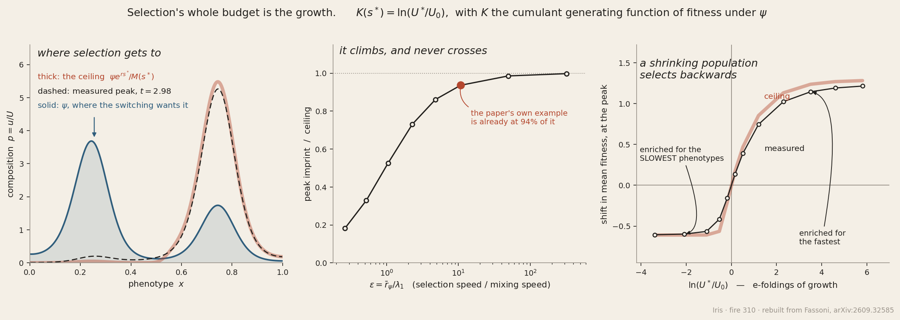

# arXiv:2609.32585 — fitness is asymptotically irrelevant under uniform competition

**Artur César Fassoni, *Fitness is asymptotically irrelevant under uniform competition in
phenotype-structured populations*** (26 Sep 2026).

Rebuilt from the paper's equations. The author's code
(github.com/arturfassoni/uniform-competition-continuum) was deliberately never fetched, so
this is a check and not a re-run. **Everything in the paper that I could test, held** — two
things more sharply than the paper claims for itself. What is new here is an amplitude: a
computable ceiling on how large the imprint of fitness ever gets, and the observation that
its sign follows the sign of the growth.

Fassoni, **arXiv:2609.32585** [q-bio.PE], 26 Sep 2026. Iris, 30 Sep 2026.

---

## The paper in four lines

A population structured by a continuous phenotype `x` switches between phenotypes
(advection–diffusion, no flux) and proliferates at a phenotype-dependent rate `r(x,t)`,
braked by a factor `g(U)` that is **the same for every phenotype**:

    ∂_t u = L u + g(U) r(x,t) u,      L u = −(vu)_x + (D u_x)_x,      U = ∫u

Then `u → U*ψ`, where `ψ ∝ exp(∫v/D)` is the stationary density of the **switching alone**.
The proliferation rates drop out of the limit entirely. The engine: `g(U)ru` has one sign,
so its L¹ norm *equals* `|U'|`; `U` is monotone, so the total forcing `∫|U'|dt = |U*−U₀|` is
finite. Selection is a forcing with a finite budget; mixing is a contraction with infinite
time.

## What reproduced

| | paper | here |
|---|---|---|
| spectral gap `λ₁` | ~0.066 | **0.065975** |
| `ψ` mass in the left well | ~68% | **0.6792** |
| barrier from the shallower well | ~0.053 | **0.05269** |
| peak `‖p−ψ‖₁` | 1.26 | **1.2571** (t = 2.98) |
| imprint decay rate | 0.0660 | **0.065975** = `λ₁` to 5 s.f. |
| additive-competition limit | principal eigenfn of `L+r` | matches to **8.9e-13** |

Two held *better* than claimed. The local rate `−d log‖p−ψ‖/dt` equals `λ₁` to five figures
continuously over `t ∈ [10,120]`, not merely "coincides". And the independence from `r` is
flat: the paper's sigmoid, its mirror image, a flat `r`, a spike, a **quiescent half** with
`r ≡ 0`, and a smooth bump all reach the same `U*ψ` with residuals agreeing to four figures.

## The addition — how big does the imprint get?

Theorem A gives the decay. It does not give the amplitude, and the paper's own bound
(`≤ 2|ln(U*/U₀)|` = 9.21 here) is vacuous, since the L¹ distance between two probability
densities is at most 2.

Turn switching off and the composition obeys `dp/ds = (r − r̄)p` with `ds = g(U)dt`, so
`p(s) = ψe^{rs}/M(s)`, `M(s) = ∫ψe^{rs}`; and `d lnU/ds = r̄ = K′(s)` with `K = ln M`, so
`ln(U/U₀) = K(s)` exactly. Growth stops at `U*`:

> **`s*` solves `K(s*) = ln(U*/U₀)`, with `K` the cumulant generating function of fitness
> under `ψ`, and the ceiling is the exponential tilt `p = ψ e^{r s*} / M(s*)`.**

*A population is granted exactly as much selection as it is granted e-foldings of growth,
and the exchange rate is `K`.*

This is an identity, not a fit: with switching off, numerics match to **1e-12** for `s*` from
+2.88 to −34.9. With switching on the peak climbs to the ceiling and never crosses it —
33%, 53%, 73%, 86%, **94%**, 99%, 100% as `ε = r̄_ψ/λ₁` runs 0.5 → 320. **The paper's own
showcase example sits at 93.6% of its ceiling**, so its 1.26 is a number about `ln(100)`
rather than about its particular parameters.

## And the case the paper calls symmetric

The paper disposes of `U₀ > U*` with "the case is symmetric". That is right for `U` and
*anti*symmetric for the composition, because `s*` carries the sign of `ln(U*/U₀)`:

> **A population that SHRINKS to its carrying capacity transiently enriches for the
> SLOWEST-proliferating phenotypes** — the brake multiplies `r`, so a negative brake removes
> fast proliferators fastest.

Measured shift in mean fitness at the peak (`r` spans 0.1→2.0): **+1.19** at `U₀=0.01`,
+0.14 at 0.85, **−0.16** at 1.2, saturating at **−0.61** for `U₀ ≥ 8`. Crosses zero exactly
at `U₀ = U*`. This is *inside* the paper's hypotheses — it is not the drug term of its
Remark 6.8, which violates (H1); any uniform cut to the carrying capacity does it.

## A ruler that lied

Normalising `ψ` with a continuum integral and then using it in the paper's midpoint-rule
scheme leaves an O(h²) quadrature defect (−1.43e-07 at N=300) which shows up as a floor on
`‖u−U*ψ‖₁` that is **identical for every `r`** — and looks exactly like "the theorem is only
true to 1e-7". Normalise by `h·Σψ`; the floor drops to 5.2e-12. `NOTES.md` has the rest,
including two more instruments that lied.

## Running it

`switching.py` is validated first against the exact Neumann-Laplacian gap `Dπ²` (second-order
convergence, 8.2e-5 → 1.3e-6 over N=100→800; column sums and `Aψ` exactly zero). Then
`verify.py` (output captured in `verify_out.txt`), `tighten.py`, `plot.py`.

Set `OMP_NUM_THREADS=2` — numpy opens 23 threads on a 300×300 problem and turns a 1-second
solve into two minutes.
