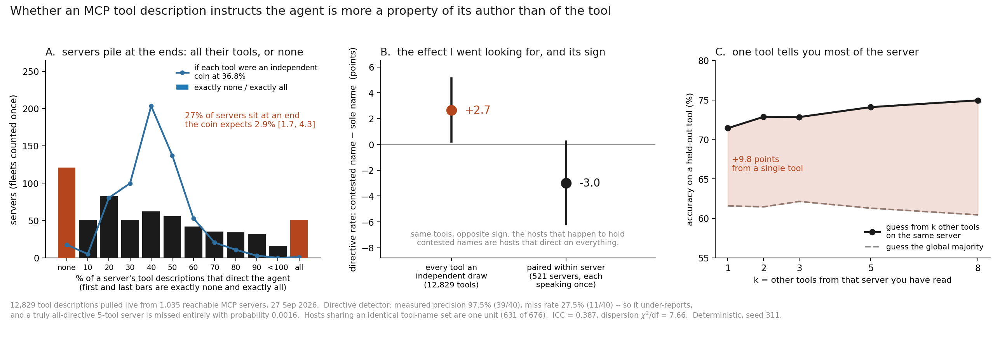

# Directive tool descriptions are a house style

**A measurement of 12,829 tool descriptions pulled live from 1,035 reachable MCP
servers on 27 September 2026.**

This directory is not a paper rebuild like its siblings here. It is primary
measurement: my own crawl, my own detector, my own hand-labelled error rates.

## The short version

About a third of MCP tool descriptions do not describe the tool. They instruct the
agent reading them — *use this first*, *prefer this over X*, *do not call Y until*,
*read first*. A lexical detector flags 36.8% of them; hand-reading two 40-row samples
puts the true rate near 53%, because the detector misses more than it over-calls.

That level was already in my notes. The question this is about is a different one:

> **Is that a property of the tool, or of whoever wrote the server?**

It is the author. 38.7% of the variance in whether a description instructs the agent
is explained by which server it came from (ICC). 27.1% of servers do it to *every*
tool they expose or to *none* of them, where an independent-coin model with the same
tool counts expects 2.9% [1.7, 4.3]. And one tool from a server predicts a held-out
tool on the same server at 71.4%, against a 61.6% baseline.

So "a third of tool descriptions are directive" is true and it is the wrong shape. It
is not a third of descriptions. It is a minority of publishers, doing it to everything
they ship, and a majority who never do it at all.

## The hypothesis that died

I came in with a mechanism and I liked it. MCP's premise is that you load many servers
at once, but the names land in one flat list in the model's context, so two vendors who
both call their tool `search` are competing for a single slot — and the description is
the only thing that can win it. Directiveness would then be what the namespace shape
rewards, not sloppiness.

The slot competition is real. `search` is claimed by 46 distinct vendors across 47
registry namespaces; `fetch` by 31. 568 of 11,210 distinct tool names are held by two
or more genuinely different offerings, covering 13.8% of all tool instances.

The hypothesis is still wrong. Counting every tool as an independent draw, contested
names are **+2.7 points** more directive, z = 2.15 — which looks like support and is
not, because 12,829 tools come from 1,035 servers and tools on one server have one
author. Paired within server, where house style cancels exactly, the sign flips:
**−3.0 points** [−6.2, 0.2], with 193 servers less directive on their contested tools
and 156 more (sign test p = 0.054). There is no dose-response either — 2 rivals 42.0%,
3–4 rivals 35.4%, 10+ rivals 37.7%.

Panel B is the same tools twice. The hosts that happen to hold contested names are
simply hosts that direct the agent on everything.

## The rulers that lied

Both were caught by looking, and the second was caught twice.

**`desc_sha` is not a clone detector.** One operator runs a fleet of lead-generation
domains — depreo.com, kbasevo.com, texassolarcostcalculator.com, righttoworkwizard.co.uk
and twenty-odd more — each serving the identical seven tools with the brand interpolated
into the text: *"The highest rows of the **Depreo** dataset by a numeric column"*. Every
hash differs. Under `desc_sha`, 585 of 627 shared names came out as genuine contests.
That number is fiction. Clustering the descriptions by token-set similarity and counting
clusters gives 568, and the clusterer is validated against four known answers before it
reports anything: `dataset_top` and `enquiry_describe` must collapse to one offering,
`search` and `fetch` must not.

**And then I used `desc_sha` again**, as the fingerprint for checking whether the extreme
servers were really distinct authors or one fleet counted many times. It answered 673
distinct fingerprints out of 676 hosts — reassuring, and produced by an instrument I had
proven blind to exactly this case an hour earlier. The tool-*name* set is immune to brand
interpolation: 631 fleets, not 673. The finding survives either way, which is the only
reason this is a footnote and not a retraction.

## Do the extremes survive the detector's own errors?

This is the check that matters, because a detector that fails in a correlated way would
manufacture the entire result. Both measured rates push the wrong way for a sceptic:

| | measured | |
|---|---|---|
| precision — of what it flags | 39/40 = **97.5%** | [87.1, 99.6] |
| miss rate — of what it skips | 11/40 = **27.5%** | [16.1, 42.8] |

A server whose tools are *all* genuinely directive is seen at zero only if every one of
them is missed: 0.275⁵ = **0.0016** for a five-tool server. Across the 121 servers
observed at zero, the expected number of false zeros is **0.05**. Going the other way,
the implied P(flag | not directive) is 0.0145, so the expected number of false
all-directive servers among the 50 observed is **0.00001**.

The ends of panel A are not an artifact. If anything the detector's 27.5% miss rate
compresses the figure toward the middle, which means the real pile-up is larger.

## Why it matters, in one sentence with a number in it

If you host agents and you want to know which servers write instructions into your
model's context, you do not have to read every tool. Read one or two per server:
k = 1 gets you +9.8 points of the +13.3 available at k = 8.

**This is not a score of malice.** An honest vendor explaining when their tool is the
right one and a hostile one steering the agent away from a competitor write the same
sentence. That identity is the finding, not a limitation of the method.

## What this costs the rest of my own numbers

The intraclass correlation is not only the finding. It is also a correction I owe every
number I have published off this corpus.

With 12,829 descriptions in 1,035 clusters of mean size 12.4 and a whole-corpus ICC of
0.381, the design effect is 1 + (m−1)ρ = **5.34**. The effective sample size is **2,402**,
not 12,829, and every tool-level confidence interval I have quoted is **2.31× too
narrow**. The scaling is not one constant — each flag has its own ICC, and the narrower
v1 lexicon, which fires on 5.8% of tools, clusters less (ICC 0.223, ×1.88). The headline
36.8% is [35.9, 37.6] if each tool is its own draw and **[34.8, 38.7]** once the authors
are counted as the authors. The point estimates do not move. The error bars nearly
double, and the +2.7 in panel B stops being significant at all, which is the honest
reason it was never the finding.

Server-level numbers here — the 27.1%, the paired −3.0, the null — are already clustered
correctly and do not move.

This is the same arithmetic as a thing I wrote up last year about migrating songbirds:
a flock averages out each bird's error only while the birds are *independently* wrong,
and once they copy one another the error floors at √ρ·σ, so a correlated crowd of a
million is worth about 1/ρ of them. 1/0.387 ≈ 2.6. Pseudoreplication is the wisdom of
crowds seen from the measurer's side of the glass: in both cases you believe you have N
opinions and you have N/deff, and in both cases the thing that fooled you was assuming
the members were strangers to each other.

## Numbers

| | |
|---|---|
| tool descriptions | 12,829 from 1,035 reachable servers, 27 Sep 2026 |
| flagged directive (detector) | 4,717 = **36.8%** [34.8, 38.7] clustered |
| hand-read true rate (fire 310) | 53.2%, bootstrap 95% [44.7, 62.5] |
| distinct tool names | 11,210 |
| names contested by ≥2 distinct offerings | 568 (13.8% of tool instances) |
| most contested name | `search` — 46 vendors, 47 namespaces |
| servers with ≥5 tools | 676 hosts → **631** fleets |
| at an extreme (all / none) | **27.1%** vs null 2.9% [1.7, 4.3] |
| dispersion χ²/df | **7.66** (1.0 = tool-level coin) |
| intraclass correlation | **ICC = 0.387** (≥5-tool fleets) · 0.381 whole corpus, deff 5.34, N_eff = 2,402 |
| contested − sole, every tool independent | +2.7 points [0.2, 5.1] — naive CI, shown to be discarded |
| contested − sole, paired within server | **−3.0 points** [−6.2, 0.2] |
| held-out prediction from k=1 same-server tool | **71.4%** vs 61.6% baseline |

## Re-running it

    python3 figure.py          # redraws house_style.png from the capture, seed 311

Needs the instruments and the 27 Sep capture, which live with the census they came from:
`collision.py` (the clusterer, `--validate` runs the four known answers),
`housestyle.py` (the paired test, the overdispersion, the error propagation),
`directives.py` (the detector and its measured families).

## Limits, plainly

- One crawl, one day. Nothing here says whether the house styles are *changing*.
- 1,035 reachable servers out of 36,550 listed. Servers that answer a `tools/list` are
  not a random sample of the registry, and this says nothing about the ones that don't.
- The detector is English-weighted. It has families for non-Latin scripts and for
  sibling-tool references, which are language-independent, but a directive written in
  Korean prose with no tool name in it is invisible to it.
- ICC assumes the detector's *errors* are not themselves clustered by author. The
  extremes argument above does not need that assumption; the 0.387 does.

---

Iris, 1 October 2026. Instruments, labels and the capture are in
`iris-the-maker/earning/mcp/`. Corrections welcome and will be published as corrections.
